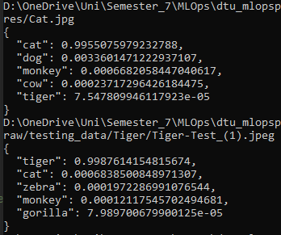

Machine Learning Operations with ConvNeXt2: A Case Study in Classification of Animal Images
==============================
[](https://www.youtube.com/watch?v=dQw4w9WgXcQ?autoplay=1)
[](https://scontent-arn2-2.xx.fbcdn.net/v/t1.15752-9/324219590_702995398045880_3444596723210508741_n.jpg?_nc_cat=108&ccb=1-7&_nc_sid=ae9488&_nc_ohc=Ib-CcSC91PUAX-bZQZQ&_nc_ht=scontent-arn2-2.xx&oh=03_AdTxAZGsuouCqphrNQsysFSHP01yAha4iFyapgjLQT7_qA&oe=63E77E24)
[](https://i.redd.it/arqzi89s0q9a1.jpg)
[](http://vafler.dk/)
[](https://i.redd.it/hyyapbqpp3v91.jpg)
[](https://miro.medium.com/max/500/1*qHbAsMNmdWQJkzm2SUA-8w.jpeg)

[](https://codecov.io/gh/rreezN/dtu_mlopsproject)


## Overall goals of the project
<p align="center">
  
</p>

The goal of this project is to use the image classification model [ConvNeXt V2](https://arxiv.org/abs/2301.00808) to classify a 10 class animal data set from [Animals - V2](https://www.kaggle.com/datasets/utkarshsaxenadn/animal-image-classification-dataset).

Our group (**42**) consists of:

David Ari Ostenfeldt, s194237\
Kristian Rhindal Møllmann, 194246\
Dennis Chenxi Zhuang, s194247\
Kristoffer Marboe, s194249\
Kasper Niklas Kjær Hansen, s194267

## What framework are you using?
For this project the [Pytorch Image Models](https://github.com/rwightman/pytorch-image-models) framework is used. This framework implements state-of-the-art image models, and is a good fit for the goals of the project. 

## How do you intend to include the framework in your project?
Pytorch Image Models contains hundreds of pretrained state of the art models, which are fit to use in our project. Initially, we will use a pre-trained model in our pipeline. Using the pre-trained model will allow us to focus on implementing the various techniques taught in the course. If possible and time permits the model can be further improved for our data set.

## What data are you going to run on (initially)?
For the project we are going to be working with the [Animals V2 Image Classification Data Set](https://www.kaggle.com/datasets/utkarshsaxenadn/animal-image-classification-dataset). The data set consists of 10 classes, with each class containing 2000 training images, 100 validation images, a varying amount of testing images and 6 interesting images. This means there are a total of 20000 training images and 1000 validation images. 

| Class       |  Cat |  Cow |  Dog | Elephant | Gorilla | Hippo | Monkey | Panda | Tiger | Zebra |
|-------------|-----:|-----:|-----:|---------:|--------:|------:|-------:|------:|------:|------:|
| Training    | 2000 | 2000 | 2000 |     2000 |    2000 |  2000 |   2000 |  2000 |  2000 |  2000 |
| Validation  |  100 |  100 |  100 |      100 |     100 |   100 |    100 |   100 |   100 |   100 |
| Testing     |  394 |  177 |   88 |      306 |      30 |    57 |    184 |   237 |   164 |   270 |
| Interesting |    6 |    6 |    6 |        6 |       6 |     6 |      6 |     6 |     6 |     6 |

The images vary in size and thus need to be transformed to a standard size.

## What deep learning models do you expect to use?
We intend to use the model [ConvNeXt V2: Co-designing and Scaling ConvNets with Masked Autoencoders](https://arxiv.org/abs/2301.00808), which is a recent update to the original ConvNeXt. The model contains pre-trained models of different sizes, of which we will be using the pretrained 3.7 million parameter model, Atto.

# Deploy locally
To deploy locally, first install [torchserve](https://github.com/pytorch/serve).

If your model is not already converted to torch_jit, then it needs to be done so. For pytorch lightning models, we supply a script. Simply run the following in a terminal, with the path to the model to be converted, and the path of the save location of the output model:

```
src/models/convert_model_jit.py path/to/model.pt path/to/output_model.pt
```

With the scripted model, if you do not already have a .mar file in model_store, then run:

```
torch-model-archiver \ 
    --model-name animal_classifier \
    --version 1.0 \
    --serialized-file models/deployable_model.pt \
    --export-path model_store \
    --handler image_classifier \
    --extra-files model_store/index_to_name.json
```

With your .mar file, you can now deploy using torchserve:

```
torchserve --start --ncs --model-store model_store --models animal_classifier=animal_classifier.mar                         
```

Then, open another terminal and run with the path to the image you wish to classify instead of path/to/my_image.jpg:

```
curl http://127.0.0.1:8080/predictions/animal_classifier -T path/to/my_image.jpg
```

You should now get the output from the deployed model, which shows the top 5 classes.

<p align="center">

</p>

--------
See [report and checklist](reports/README.md).

<p><small>Project based on the <a target="_blank" href="https://drivendata.github.io/cookiecutter-data-science/">cookiecutter data science project template</a>. </small></p>
# cookiecutterdatascience </p>
# dtu_mlopsproject 
